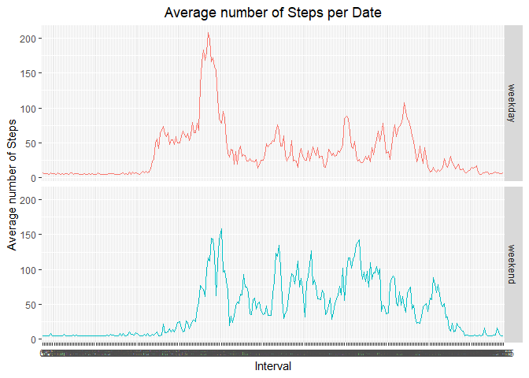

## Loading and preprocessing the data


```r
library(data.table)
library(ggplot2)
library(scales)
library(Hmisc)
raw_data <- read.table(unz("activity.zip", "activity.csv"), header=T,
		       quote="\"", sep=",")
raw_data$date <- as.Date(raw_data$date)
raw_data$interval <- as.factor(raw_data$interval)
```


## What is mean total number of steps taken per day?


```r
library(data.table)
library(ggplot2)
library(scales)
library(Hmisc)
```

```
## Loading required package: lattice
```

```
## Loading required package: survival
```

```
## Loading required package: Formula
```

```
## 
## Attaching package: 'Hmisc'
```

```
## The following objects are masked from 'package:base':
## 
##     format.pval, units
```

```r
non_NA_data <- raw_data[complete.cases(raw_data[c(1,3)]), c("steps","date")]
#non_NA_data <- tapply(raw_data$steps, raw_data$date, sum, na.rm=TRUE)

steps_per_day <- aggregate(steps~date, non_NA_data, FUN=sum)
graph <- ggplot(steps_per_day, aes(y=steps,x=date,fill=date))
graph+geom_histogram(stat = 'identity')+
	xlab('Date')+
	ylab('Number of Steps')+
	ggtitle('Number of Steps per Date')+
	theme(plot.title = element_text(hjust = 0.5))
```

```
## Warning: Ignoring unknown parameters: binwidth, bins, pad
```

<!-- -->

```r
mean_steps <- mean(steps_per_day$steps)
median_steps <- median(steps_per_day$steps)
```
The mean of the steps taken each day is 1.0766189\times 10^{4} and its median is 10765.

## What is the average daily activity pattern?


```r
library(data.table)
library(ggplot2)
library(scales)
library(Hmisc)

non_NA_data <- raw_data[complete.cases(raw_data), c(2,3)]
steps_by_interval <- averageStepsPerTimeBlock <- aggregate(x=list(meanSteps=raw_data$steps), by=list(interval=raw_data$interval), FUN=mean, na.rm=TRUE)
graph <- ggplot(steps_by_interval, aes(y=meanSteps,x=interval, group=1))
graph + geom_line()+
	xlab('Interval')+
	ylab('Mean of Steps')+
	ggtitle('Mean of Steps per Interval')+
	theme(plot.title = element_text(hjust = 0.5))
```

<!-- -->

```r
mostSteps <- which.max(steps_by_interval$meanSteps)
timeMostSteps <-  gsub("([0-9]{1,2})([0-9]{2})", "\\1:\\2", averageStepsPerTimeBlock[mostSteps,'interval'])
```

The interval with the highest mean is 8:35


## Imputing missing values

```r
num_NA <- nrow(raw_data[!complete.cases(raw_data),])
```
The number of missing values in the dataset is 2304

```r
imputed_data <- raw_data
imputed_data$steps <- impute(raw_data$steps, fun = mean)
```


```r
non_NA_data <- imputed_data[complete.cases(imputed_data), c("steps","date")]
steps_per_day <- aggregate(steps~date, non_NA_data, FUN=sum)
graph <- ggplot(steps_per_day, aes(y=steps,x=date,fill=date))
graph+geom_histogram(stat = 'identity')+
	xlab('Date')+
	ylab('Number of Steps(imputed)')+
	ggtitle('Number of Steps(imputed) per Date')+
	theme(plot.title = element_text(hjust = 0.5))
```

```
## Warning: Ignoring unknown parameters: binwidth, bins, pad
```

<!-- -->

```r
mean_steps <- mean(steps_per_day$steps)
median_steps <- median(steps_per_day$steps)
```
The mean of the steps taken each day is 1.0766189\times 10^{4} and its median is 1.0766189\times 10^{4}.
## Are there differences in activity patterns between weekdays and weekends?

```r
library(data.table)
library(ggplot2)
library(scales)
library(Hmisc)

raw_data <- read.table(unz("activity.zip", "activity.csv"), header=T,
		       quote="\"", sep=",")
weekday_imputed_data <- imputed_data
weekday_imputed_data$weekend <- 
	ifelse(as.POSIXlt(weekday_imputed_data[,2])$wday %in% c(0,6),'weekend', 'weekday')

averaged_weekday_imputed_data <- aggregate(steps~interval+weekend,
					   data = weekday_imputed_data, mean)

graph <- ggplot(averaged_weekday_imputed_data, aes(interval, steps ,
						   color=weekend,group=1))
graph+geom_line()+
	facet_grid(weekend~.)+
	xlab('Interval')+
	ylab('Average number of Steps')+
	ggtitle('Average number of Steps per Date')+
	theme(plot.title = element_text(hjust = 0.5),legend.position = "none")
```

<!-- -->
